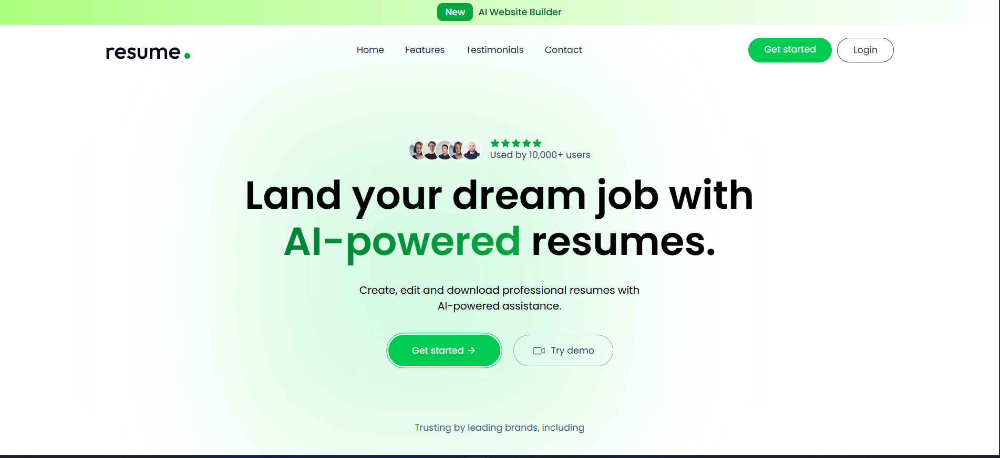
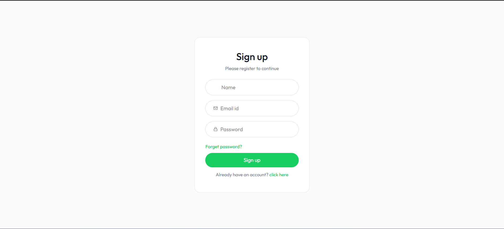
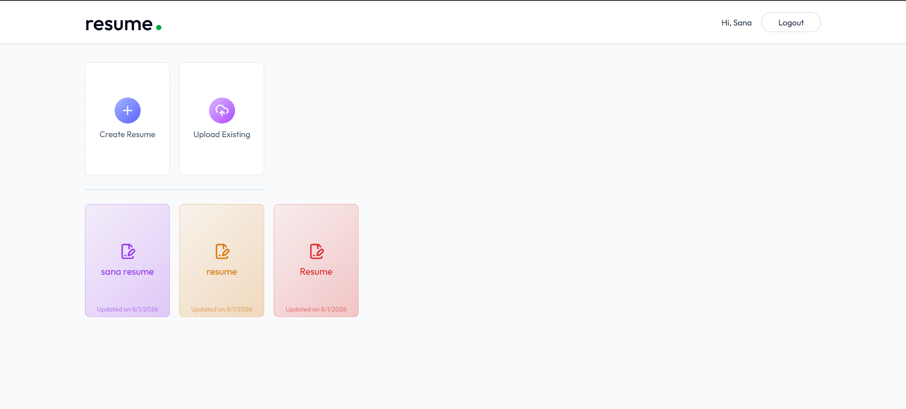
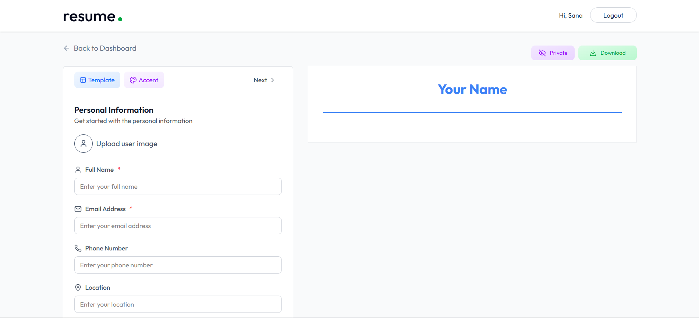

# 🚀 AI Resume Builder

An AI-powered Resume Builder that helps users create, customize, and download professional resumes with a modern, responsive interface.

🌐 **Live Demo:** https://ai-resume-builder-roan-three.vercel.app

---

## 📌 Features

- 🔐 User Authentication (Signup/Login)
- 👤 User Profile Management
- 📝 Create and Edit Resumes
- 🤖 AI-assisted Resume Generation
- 📄 Download Resume
- 📱 Fully Responsive Design
- ☁️ Cloud Image Upload Support
- ⚡ Fast and Modern UI

---

## 🛠️ Tech Stack

### Frontend
- React.js
- Vite
- Tailwind CSS
- Axios
- React Router DOM

### Backend
- Node.js
- Express.js
- MongoDB
- Mongoose
- JWT Authentication
- bcrypt.js

### Deployment
- Frontend: Vercel
- Backend: Render
- Database: MongoDB Atlas

---

## 📂 Project Structure

```
AI-Resume-Builder
│
├── client/        # React Frontend
├── server/        # Express Backend
├── README.md
└── package.json
```

---

## ⚙️ Installation

### Clone Repository

```bash
git clone https://github.com/sanjanak8373-cpu/AI-Resume-Builder.git
```

```bash
cd AI-Resume-Builder
```

---

## Frontend Setup

```bash
cd client
npm install
npm run dev
```

---

## Backend Setup

```bash
cd server
npm install
npm start
```

---

## 🔑 Environment Variables

### Backend (.env)

```env
PORT=5000

MONGO_URI=your_mongodb_connection

JWT_SECRET=your_secret

IMAGEKIT_PUBLIC_KEY=your_public_key

IMAGEKIT_PRIVATE_KEY=your_private_key

IMAGEKIT_URL_ENDPOINT=your_url_endpoint
```

### Frontend (.env)

```env
VITE_BASE_URL=https://your-backend-url.onrender.com
```

---

## 📸 Screenshots

### Home Page



### Register Page




### Dashboard



### Resume Builder




---

## 🚀 Live Links

Frontend

https://ai-resume-builder-roan-three.vercel.app

Backend

https://ai-resume-builder-backend-kxdz.onrender.com

---

## Future Improvements

- Multiple Resume Templates
- AI Resume Suggestions
- Cover Letter Generator
- Resume Score Analyzer
- Dark Mode
- Export to PDF
- Drag & Drop Sections

---

## 🤝 Contributing

Contributions are welcome!

1. Fork the repository

2. Create a new branch

```bash
git checkout -b feature-name
```

3. Commit changes

```bash
git commit -m "Added new feature"
```

4. Push

```bash
git push origin feature-name
```

5. Create a Pull Request

---

## 👩‍💻 Author

**Sanjana**

GitHub:
https://github.com/sanjanak8373-cpu

LinkedIn:
(Add your LinkedIn profile)

---

## ⭐ Support

If you found this project helpful, don't forget to **Star ⭐ the repository**.
